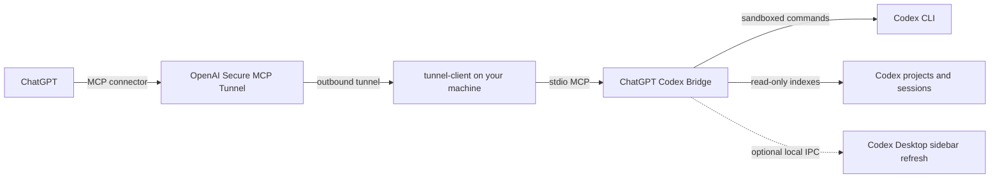

# Codex with ChatGPT

[简体中文](README.zh-CN.md) | [Security](SECURITY.md) | [Contributing](CONTRIBUTING.md)

ChatGPT thinks. Codex works. `codex-with-chatgpt` is a local-first MCP bridge that lets ChatGPT inspect multiple Codex Desktop projects and sessions, then dispatch confirmed work to the local Codex CLI or app-server.

The product name is **Codex with ChatGPT**. The repository slug and existing runtime alias remain `chatgpt-codex-bridge` and `codex-bridge` for compatibility with existing installations.

> [!IMPORTANT]
> This is an independent community project. It is not an official OpenAI product and is not affiliated with or endorsed by OpenAI. ChatGPT, Codex, and OpenAI are trademarks of their respective owner.

## What it does

- Discovers projects already registered in Codex Desktop, without granting access to the entire home directory.
- Runs analysis and planning in the Codex read-only sandbox.
- Requires a short-lived, single-use confirmation token before workspace writes.
- Lists and reads visible Codex sessions with cursor pagination and redaction.
- Supports time-limited, user-confirmed access to individual projectless sessions in Codex Desktop's Recent section.
- Builds bounded project-history context without loading multi-gigabyte histories into memory.
- Creates and continues persistent Codex Desktop sessions through the local Codex app-server protocol.
- Hands ChatGPT-provided context to Codex as untrusted reference text, with secret detection.
- Uses background jobs so long Codex tasks do not hold an MCP tunnel request open.
- Reports a small execution protocol (`INIT` → `EXECUTING` → `EXECUTED` / `ERROR`) so ChatGPT can poll and review tasks consistently.

The bridge does not expose an arbitrary shell tool and does not listen on a public port. Remote access is provided by the official [OpenAI Secure MCP Tunnel client](https://github.com/openai/tunnel-client).

## Architecture



The optional sidebar refresh path depends on a private, unsupported Codex Desktop extension and is not included in this repository. The core bridge works without it; newly created persistent sessions may require a Codex Desktop restart before they appear in the sidebar.

## How the workflow works

```text
ChatGPT asks for a task
  → Bridge validates the project or session boundary
  → Codex runs in a bounded sandbox
  → ChatGPT polls the job and reads every output page
  → ChatGPT reviews the result and asks for the next step
```

The bridge keeps the execution state and ChatGPT keeps the planning/review state. A task result never means that a write was approved: workspace writes still require the exact-request confirmation flow.

## Requirements

- macOS or Linux with Python 3.11+
- A working `codex` CLI installation and sign-in
- Codex Desktop for automatic project discovery and session history features
- Homebrew for the documented Tunnel installation path
- OpenAI organization access to Secure MCP Tunnels

This project is currently tested on macOS. Windows is not supported because the optional Desktop notification path uses Unix sockets.

## Quick start

```bash
git clone https://github.com/AaAndrew233/chatgpt-codex-bridge.git
cd chatgpt-codex-bridge
./scripts/bootstrap.sh
```

`bootstrap.sh` creates a local virtual environment, installs the reviewed dependency lock, and generates untracked `config.json` and `.mcp.json` files. It never overwrites existing configuration.

Open `config.json` and choose one authorization source:

```json
{
  "codex_command": "codex",
  "model": null,
  "codex_project_catalog": "~/.codex/.codex-global-state.json",
  "allowed_roots": [],
  "session_access_ttl_seconds": 3600
}
```

- Keep `model` as `null` to inherit your current Codex configuration.
- Keep `allowed_roots` empty to use only projects registered in Codex Desktop.
- Add narrow project directories to `allowed_roots` only when automatic discovery is unavailable.
- `session_access_ttl_seconds` controls the in-memory lifetime of an approved projectless-session grant and cannot exceed 24 hours.
- Never authorize `/` or your home directory. The bridge rejects both.

Run the local checks:

```bash
./scripts/check_public_release.py
.venv/bin/python -m unittest discover -s tests -v
```

## Connect through Secure MCP Tunnel

Install the official client:

```bash
brew install openai/tools/tunnel-client
tunnel-client --version
tunnel-client help quickstart
```

Store the runtime key in a file outside this repository and restrict its permissions:

```bash
chmod 600 /ABSOLUTE/PATH/TO/runtime-key
```

Create a managed background runtime. Replace all placeholder values:

```bash
tunnel-client runtimes connect \
  --alias codex-bridge \
  --profile codex-bridge \
  --tunnel-id '<YOUR_TUNNEL_ID>' \
  --runtime-api-key 'file:/ABSOLUTE/PATH/TO/runtime-key' \
  --mcp-command '/ABSOLUTE/PATH/TO/chatgpt-codex-bridge/scripts/run_server.sh'
```

Verify that the managed runtime is running, healthy, and ready:

```bash
tunnel-client runtimes status codex-bridge --json
```

Then create or refresh the connector in [ChatGPT connector settings](https://chatgpt.com/#settings/Connectors). The official Tunnel onboarding guide is the source of truth for organization roles, tunnel IDs, runtime keys, and current commands: [openai/tunnel-client/docs/onboarding.md](https://github.com/openai/tunnel-client/blob/master/docs/onboarding.md).

Do not use an admin key for the long-running runtime. Do not commit runtime keys, tunnel IDs, generated profiles, `config.json`, or `.mcp.json`.

## Updating and refreshing

After changing bridge code, restart the managed runtime. A connector refresh is only needed when the MCP tool list, tool names, descriptions, input schemas, or annotations change. After refreshing metadata, start a new ChatGPT conversation so it receives the current tool definitions.

```text
Code update                    → restart the local bridge/runtime
Tool schema or metadata change → restart runtime → Refresh connector → new ChatGPT conversation
Tunnel ID or account change    → reconnect the connector
```

`codex_status` reports the bridge version, tool schema version, and this maintenance policy so a stale ChatGPT conversation can be diagnosed instead of silently falling back to an older workflow.

## First test in ChatGPT

Start a new ChatGPT conversation with the connector enabled and ask:

```text
Call codex_status. Show only whether the bridge is healthy, the available tool names,
and the registered project names. Do not modify files.
```

Then test a read-only task:

```text
Use codex_analyze on <PROJECT_PATH> to summarize the project structure and identify
the three highest-risk areas. Poll the job until it finishes and retrieve every output page.
Do not modify files.
```

For a write, ChatGPT must first call `codex_prepare_apply`, show you the exact plan, obtain your explicit confirmation, and only then call `codex_apply` with the returned token.

For a projectless session under **Recent**, ChatGPT first calls `codex_list_sessions(include_unassigned=true)`. The result exposes only redacted sidebar metadata. It must then call `codex_prepare_session_access`, show you the session title, canonical working directory, access mode, and exact write request when applicable, and wait for explicit approval. The returned access token activates an in-memory grant for that session only. Workspace writes additionally require the exact-request confirmation token returned by the same preparation call.

## MCP tools

| Tool | Purpose | Write confirmation |
| --- | --- | --- |
| `codex_status` | Health, bridge/tool versions, maintenance policy, projects, jobs, and compatibility snapshot | No |
| `codex_list_projects` | List authorized Codex projects | No |
| `codex_prepare_project_context` | Build bounded, paginated project history context | No |
| `codex_analyze` | Submit a read-only Codex task | No |
| `codex_plan` | Submit a planning-only Codex task | No |
| `codex_prepare_apply` | Issue a short-lived token for one exact write request | No |
| `codex_apply` | Submit a workspace-write Codex task | Yes |
| `codex_job_status` | Poll a background job | No |
| `codex_job_result` | Read a completed result with output pagination | No |
| `codex_cancel_job` | Cancel a queued or running job | No |
| `codex_list_sessions` | List visible Codex sessions with pagination | No |
| `codex_read_session` | Read visible user and assistant messages with redaction | No |
| `codex_prepare_session_access` | Prepare a time-limited grant for one projectless Recent session | User approval |
| `codex_create_desktop_session` | Create a persistent Codex Desktop session | Write mode only |
| `codex_continue_desktop_session` | Continue a persistent session | Write mode only |
| `codex_handoff_chat_context` | Create a session with explicit ChatGPT context | Write mode only |

## Security model

The trust boundary is intentionally narrow:

- Project access is limited to validated Codex project roots or explicit narrow roots.
- Projectless Recent sessions remain hidden by default and require a short-lived grant bound to one session, canonical directory, and mode.
- Sensitive directories such as `.ssh`, `.aws`, `.gnupg`, `.kube`, `.config`, and `Library` are rejected during automatic discovery.
- Codex subprocesses receive a minimal environment and run with explicit sandbox modes.
- Write tokens expire, are single-use, and are bound to the exact project and request.
- Session output is filtered to user-visible messages and redacted before leaving the machine.
- Request, output, scan, concurrency, retention, and timeout limits are bounded.
- ChatGPT context is treated as untrusted input and cannot override local policy.

Read [docs/security-model.md](docs/security-model.md) before exposing the bridge to a team. Vulnerability reports should follow [SECURITY.md](SECURITY.md).

## Operational limits

Default limits are documented in `config.example.json` and enforced at startup. Important defaults include two concurrent jobs, 30-minute completed-job retention, a one-hour session grant, a 120,000-character request ceiling, paginated 100,000-character job output, and bounded streaming scans for project history.

`scan_complete` answers whether the configured source scan finished. `context_complete` separately answers whether all scanned text fit in the returned context budget. A complete scan is not the same as an unbounded export.

## Development

```bash
./scripts/bootstrap.sh
.venv/bin/python -m unittest discover -s tests -v
.venv/bin/python -m compileall -q \
  bridge_core.py conversation_catalog.py desktop_assignment.py \
  desktop_sessions.py project_context.py server.py
```

See [CONTRIBUTING.md](CONTRIBUTING.md) for contribution rules, [docs/architecture.md](docs/architecture.md) for module boundaries, and [docs/update.md](docs/update.md) for maintenance and connector refresh rules.

## License

Apache License 2.0. See [LICENSE](LICENSE).
