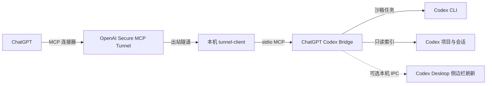

# ChatGPT Codex Bridge

[English](README.md) | [安全策略](SECURITY.md) | [参与贡献](CONTRIBUTING.md)

这是一个本地优先的 MCP 桥接服务，让 ChatGPT 能够查看已登记的 Codex 项目、读取 Codex 会话历史，并在用户确认后把任务交给本机 Codex CLI 执行。

> [!IMPORTANT]
> 这是独立的社区项目，不是 OpenAI 官方产品，也未获得 OpenAI 的关联或背书。ChatGPT、Codex、OpenAI 是其权利人的商标。

## 能做什么

- 自动读取 Codex Desktop 已登记项目，但不会授权整个用户目录。
- 分析和规划任务默认使用 Codex 只读沙箱。
- 修改文件前必须使用短时、一次性、与完整请求绑定的确认令牌。
- 分页列出和读取 Codex 可见会话，并对敏感信息脱敏。
- 支持在用户确认后，短时授权访问 Codex Desktop“最近”中的单个无项目会话。
- 流式整理项目历史，避免把数 GB 会话一次性载入内存。
- 通过本地 Codex app-server 创建和续聊持久 Desktop 会话。
- 把 ChatGPT 主动提供的上下文作为不可信参考资料交给 Codex，并拒绝明显密钥。
- 长任务在后台运行，避免 MCP Tunnel 单次请求长期占用后超时。

Bridge 不提供任意 Shell 工具，也不会自行监听公网端口。远程连接使用 OpenAI 官方 [Secure MCP Tunnel client](https://github.com/openai/tunnel-client)。

## 架构



侧边栏实时刷新依赖非公开、非官方支持的 Codex Desktop 扩展，本仓库不包含该扩展。核心 Bridge 不依赖它；没有扩展时，持久会话仍会创建，但可能要重启 Codex Desktop 才会出现在侧边栏。

## 环境要求

- macOS 或 Linux，Python 3.11+
- 已安装并登录可用的 `codex` CLI
- 如需自动项目发现和会话读取，需要 Codex Desktop
- 按本文安装 Tunnel 时需要 Homebrew
- OpenAI 组织已获得 Secure MCP Tunnel 权限

当前主要在 macOS 验证。由于可选 Desktop 通知使用 Unix socket，暂不支持 Windows。

## 快速开始

```bash
git clone https://github.com/AaAndrew233/chatgpt-codex-bridge.git
cd chatgpt-codex-bridge
./scripts/bootstrap.sh
```

初始化脚本会创建本地虚拟环境、安装已审查的依赖锁，并生成不会被 Git 跟踪的 `config.json` 和 `.mcp.json`。已有配置不会被覆盖。

打开 `config.json`，选择一种授权来源：

```json
{
  "codex_command": "codex",
  "model": null,
  "codex_project_catalog": "~/.codex/.codex-global-state.json",
  "allowed_roots": [],
  "session_access_ttl_seconds": 3600
}
```

- `model` 保持 `null`，即可继承当前 Codex 配置的模型。
- `allowed_roots` 保持空数组，只使用 Codex Desktop 已登记项目。
- 自动发现不可用时，才添加范围明确的项目目录。
- `session_access_ttl_seconds` 控制无项目会话授权在内存中的有效时间，最长不能超过 24 小时。
- 不要授权 `/` 或用户主目录，Bridge 也会拒绝这两种配置。

运行本地检查：

```bash
./scripts/check_public_release.py
.venv/bin/python -m unittest discover -s tests -v
```

## 通过 Secure MCP Tunnel 连接

安装官方客户端：

```bash
brew install openai/tools/tunnel-client
tunnel-client --version
tunnel-client help quickstart
```

把 Runtime Key 保存在仓库外的独立文件，并限制权限：

```bash
chmod 600 /ABSOLUTE/PATH/TO/runtime-key
```

创建由官方客户端托管的后台 Runtime。所有占位符都需要替换：

```bash
tunnel-client runtimes connect \
  --alias codex-bridge \
  --profile codex-bridge \
  --tunnel-id '<YOUR_TUNNEL_ID>' \
  --runtime-api-key 'file:/ABSOLUTE/PATH/TO/runtime-key' \
  --mcp-command '/ABSOLUTE/PATH/TO/chatgpt-codex-bridge/scripts/run_server.sh'
```

验证后台进程正在运行，且健康检查和就绪检查都通过：

```bash
tunnel-client runtimes status codex-bridge --json
```

然后在 [ChatGPT 连接器设置](https://chatgpt.com/#settings/Connectors) 中创建或刷新连接器。组织角色、Tunnel ID、Runtime Key 和最新命令，以官方文档为准：[openai/tunnel-client/docs/onboarding.md](https://github.com/openai/tunnel-client/blob/master/docs/onboarding.md)。

长期运行的 Runtime 不要使用 Admin Key。不要提交 Runtime Key、Tunnel ID、生成的 Profile、`config.json` 或 `.mcp.json`。

## 在 ChatGPT 中首次测试

新建一个 ChatGPT 对话，启用连接器后发送：

```text
调用 codex_status。只告诉我桥接是否健康、可用工具名称和已登记项目名称，不要修改文件。
```

继续测试只读分析：

```text
使用 codex_analyze 分析 <PROJECT_PATH>，总结项目结构并指出风险最高的三个区域。
自动轮询任务直到结束，并取完所有输出分页。不要修改文件。
```

需要写入时，ChatGPT 必须先调用 `codex_prepare_apply`，向你展示完整计划并取得明确确认，然后才能携带返回令牌调用 `codex_apply`。

对于“最近”中的无项目会话，ChatGPT 先调用 `codex_list_sessions(include_unassigned=true)`；此时只返回脱敏后的侧边栏元数据。随后必须调用 `codex_prepare_session_access`，向你展示会话标题、规范化工作目录、访问模式，以及写入时的准确任务，并等待明确确认。确认后的授权只保存在内存中，只绑定这一个会话。写入时还必须同时使用该准备调用返回的准确任务确认令牌。

## 工具清单

| 工具 | 用途 | 是否需要写入确认 |
| --- | --- | --- |
| `codex_status` | 健康状态、能力、项目、任务和兼容快照 | 否 |
| `codex_list_projects` | 列出已授权 Codex 项目 | 否 |
| `codex_prepare_project_context` | 自动整理有界、可分页的项目历史 | 否 |
| `codex_analyze` | 提交只读 Codex 任务 | 否 |
| `codex_plan` | 提交只输出计划的 Codex 任务 | 否 |
| `codex_prepare_apply` | 为一个准确写入请求生成短时令牌 | 否 |
| `codex_apply` | 提交工作区写入任务 | 是 |
| `codex_job_status` | 查询后台任务状态 | 否 |
| `codex_job_result` | 分页读取任务结果 | 否 |
| `codex_cancel_job` | 取消排队或运行中的任务 | 否 |
| `codex_list_sessions` | 分页列出 Codex 可见会话 | 否 |
| `codex_read_session` | 脱敏读取可见用户与助手消息 | 否 |
| `codex_prepare_session_access` | 为一个无项目“最近”会话准备短时授权 | 需要用户确认 |
| `codex_create_desktop_session` | 创建持久 Codex Desktop 会话 | 仅写入模式 |
| `codex_continue_desktop_session` | 继续持久会话 | 仅写入模式 |
| `codex_handoff_chat_context` | 使用显式 ChatGPT 上下文创建会话 | 仅写入模式 |

## 安全边界

- 项目访问仅限通过校验的 Codex 项目根目录或明确配置的小范围目录。
- 无项目“最近”会话默认隐藏，必须取得绑定单个会话、规范化目录和模式的短时授权。
- 自动发现时拒绝 `.ssh`、`.aws`、`.gnupg`、`.kube`、`.config`、`Library` 等敏感目录。
- Codex 子进程只继承最小环境，并使用明确的沙箱模式。
- 写入令牌会过期、只能使用一次，并绑定项目与完整请求。
- 会话输出只保留用户可见消息，并在离开本机前脱敏。
- 请求、输出、扫描、并发、保留时长和执行超时都有明确上限。
- ChatGPT 上下文始终作为不可信输入，不能覆盖本地策略。

团队使用前请阅读 [docs/security-model.md](docs/security-model.md)。安全问题请按 [SECURITY.md](SECURITY.md) 私下报告。

## 运行限制

默认限制集中在 `config.example.json` 并在启动时校验，包括最多两个并发任务、完成结果保留 30 分钟、会话授权保留 1 小时、请求最多 120,000 字符、任务输出每页 100,000 字符，以及项目历史的流式扫描预算。

`scan_complete` 表示配置范围内的源数据是否扫描完成；`context_complete` 表示扫描到的原文是否全部放进当前输出预算。这两个状态不能混为一谈。

## 开发与验证

```bash
./scripts/bootstrap.sh
.venv/bin/python -m unittest discover -s tests -v
.venv/bin/python -m compileall -q \
  bridge_core.py conversation_catalog.py desktop_assignment.py \
  desktop_sessions.py project_context.py server.py
```

模块边界见 [docs/architecture.md](docs/architecture.md)，贡献要求见 [CONTRIBUTING.md](CONTRIBUTING.md)。

## 许可证

Apache License 2.0，详见 [LICENSE](LICENSE)。
